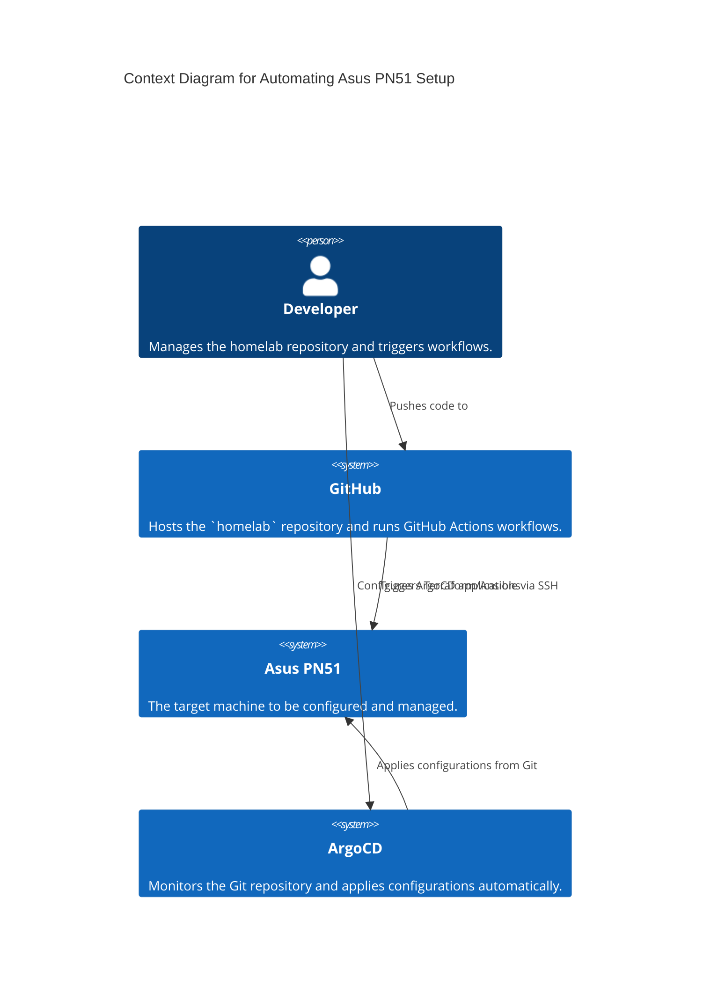
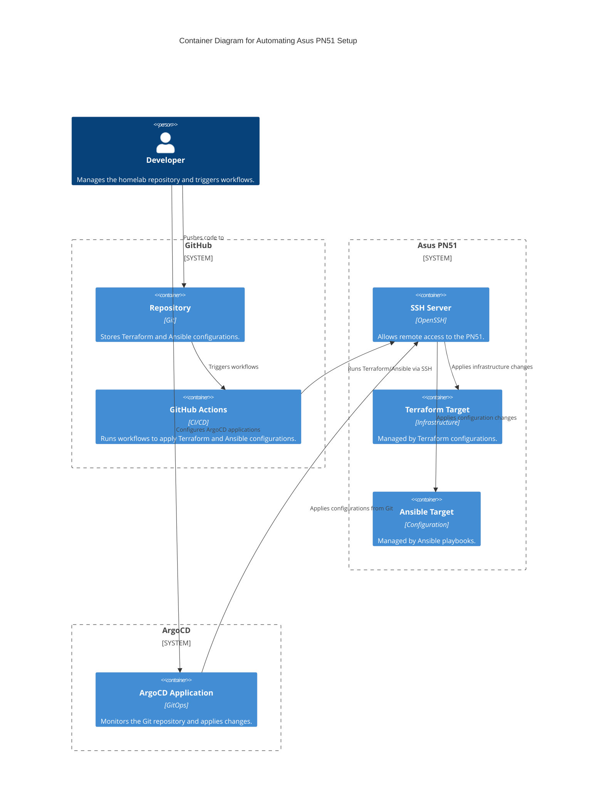

# Architecture Diagrams

## Automating Asus PN51 Setup - C4 Model Diagrams

This document provides two diagrams using the C4 model to visualize the architecture for automating the setup of an Asus PN51 using GitHub Actions and ArgoCD.

---

## Context Diagram

The Context Diagram provides a high-level overview of the external systems interacting with the automation setup.

