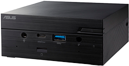

## Asus PN51 Home Server Configuration

Asus PN51
* AMD Ryzen™ 7 5700U Processor 1.8GHz (12M Cache, up to 4.3GHz)
* Integrated - Radeon™ Vega Graphics
* Gigabit LAN, Realtek® 8111EP
* 32GB Crucial Ballistix LDDR4 Memory
* 1TB Samsung 980 NVME PCIE4.0 

### Networking:

- TODO: setup Firewall: (e.g. Cloudflare tunnels)
- TODO: setup Auth proxy: (e.g. Authelia)

### USB content

- [ventoy](https://ventoy.net) (boot loader)
- Linux images
